# x10aix-skills: Ökosystem & Abhängigkeiten

Dieses Dokument kartografiert die Abhängigkeiten und Wechselwirkungen zwischen den internen Agent-Skills (`skills/internal`). Es dient als Referenz, um zu verstehen, welche Skills zwingend erforderlich sind, wenn ein Agent delegiert.

## Abhängigkeits-Matrix

| Skill | Beschreibt / Funktion | Erfordert / Delegiert an |
|-------|-----------------------|--------------------------|
| **google-ads-manager** | Kampagnen-Management und Bidding | `ad-expert` (für Copywriting) |
| **docs-ci-restyler** | Formatiert bestehende Google Docs nach CI | `brand-guidelines`, `x10aix-design-system` |
| **marketing-campaign-planning** | Plant Kampagnenstrukturen | `marketing-competitive-analysis`, `marketing-brand-voice` |
| **marketing-content-creation** | Erstellt Landingpages und Posts | `ad-expert`, `brand-enforcement`, `x10aix-design-system` |
| **sales-draft-outreach** | Schreibt Kaltakquise E-Mails | `sales-account-research`, `sales-competitive-intelligence` |
| **sales-call-prep** | Vorbereitung auf anstehende Calls | `sales-account-research`, `sales-daily-briefing` |
| **skill-engineer** | Meta-Skill zur Erstellung neuer Skills | `agent-publish-workflow` (für Releases) |
| **obsidian-vault-curator** | Schreibt strukturierte, schema-konforme Notes in den x10aix Vault | `obsidian-vault-linker` (Schritt 7), `tag-catalog.json` (Schritt 1) |
| **obsidian-vault-linker** | Findet Top-5 verwandte Notes via vault-index.json | *(standalone — wird von vault-curator aufgerufen)* |

## Visuelles Dependency-Mapping

```mermaid
graph TD
    %% Meta Skills
    SE[skill-engineer] --> APW[agent-publish-workflow]

    %% Marketing Hub
    GAM[google-ads-manager] --> AE[ad-expert]
    MCP[marketing-campaign-planning] --> MCA[marketing-competitive-analysis]
    MCP --> MBV[marketing-brand-voice]
    MCC[marketing-content-creation] --> AE
    MCC --> BE[brand-enforcement]
    MCC --> XDS[x10aix-design-system]

    %% CI / Docs
    DCR[docs-ci-restyler] --> BG[brand-guidelines]
    DCR --> XDS

    %% Sales Hub
    SDO[sales-draft-outreach] --> SAR[sales-account-research]
    SDO --> SCI[sales-competitive-intelligence]
    SCP[sales-call-prep] --> SAR
    SCP --> SDB[sales-daily-briefing]

    %% Knowledge Management
    OVC[obsidian-vault-curator] --> OVL[obsidian-vault-linker]
    OVC --> TC[(tag-catalog.json)]
    OVL --> VI[(vault-index.json)]

    %% Formatting
    classDef meta fill:#f9f,stroke:#333,stroke-width:2px;
    classDef marketing fill:#bbf,stroke:#333,stroke-width:2px;
    classDef sales fill:#bfb,stroke:#333,stroke-width:2px;
    classDef ci fill:#fbb,stroke:#333,stroke-width:2px;
    classDef km fill:#ffe4b5,stroke:#333,stroke-width:2px;
    classDef data fill:#e8e8e8,stroke:#999,stroke-width:1px;

    class SE,APW meta;
    class GAM,MCP,MCC,MCA,MBV,AE marketing;
    class SDO,SCP,SAR,SCI,SDB sales;
    class DCR,BG,XDS,BE ci;
    class OVC,OVL km;
    class TC,VI data;
```

> **Hinweis:** Clawdbot-Skills (`skills/clawdbot`), Forked-Skills (`skills/forked`) und Vendor-Skills (`skills/vendor`) sind strikt isoliert und verfügen über keine internen Querabhängigkeiten zum Marketing- oder Sales-Cluster, um Nebenwirkungen auf den Hetzner-Servern zu verhindern.
