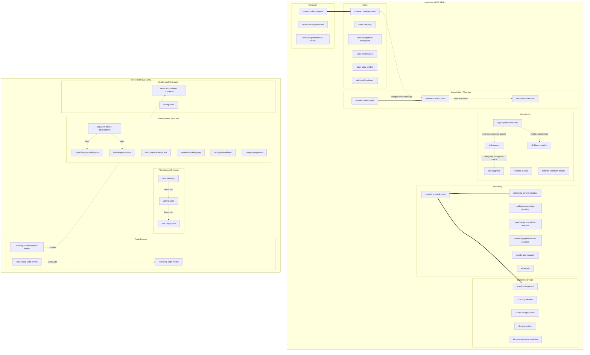

# Agent Ecosystem Map — Global

> **Scope:** Global Map (core-internal + core-vendor)  
> **Generated by:** skill-mapper v2.0 | 2026-06-21  
> **Total Skills:** 45 (30 core-internal + 15 core-vendor)  
> **Excluded:** clawdbot domain (include_in_global: false)  

---

## Dependency Graph

---

## Conflict Summary (Intra-Domain: core-internal)

| # | Skills | Overlap | Recommendation |
|---|--------|---------|----------------|
| 1 | `marketing-brand-voice` === `marketing-content-creation` | Both trigger on LinkedIn-Post writing | Strict boundary: create vs review. Consider Router-Skill. |
| 2 | `marketing-brand-voice` === `brand-enforcement` | Both check brand compliance | Merge or split: brand-enforcement = visual-only |
| 3 | `research-client-signals` === `sales-account-research` | Both do company research pre-contact | Make research-client-signals a sub-task of sales-account-research |
| 4 | `obsidian-inbox-writer` === `obsidian-vault-curator` | Both triggered by "save to vault" | inbox-writer = user-facing quick capture; vault-curator = agent-facing structured output |

---

## New/Unknown Directories Detected

| Path | Status | Decision |
|------|--------|----------|
| `addons/skill-mapper/` | 1 SKILL.md found (older skill-mapper v1 build artifact) | **Excluded** — treated as build/deploy artifact, not a domain skill |
| `dist/` (workspace root) | 1 SKILL.md found (skill-engineer dist) | **Excluded** — build artifact |
| `skills/forks/` | Empty directory | **Excluded** — no SKILL.md files |

---

## Domain Index

| Domain | Skills | Ecosystem File | In Global Map |
|--------|--------|----------------|---------------|
| core-internal | 30 | [ECOSYSTEM-internal.md](./ECOSYSTEM-internal.md) | ✅ Yes |
| core-vendor | 15 | [ECOSYSTEM-vendor.md](./ECOSYSTEM-vendor.md) | ✅ Yes |
| clawdbot | 67 | [ECOSYSTEM-clawdbot.md](./ECOSYSTEM-clawdbot.md) | ❌ No |
| **Total** | **112** | — | — |
